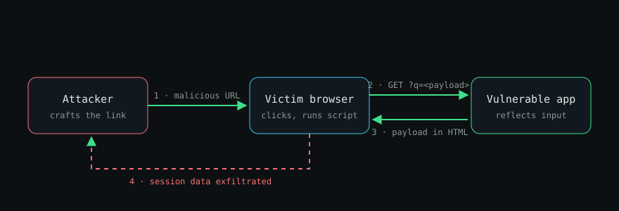

> **This is a template post.** It shows everything the blog can render: headings, code with syntax highlighting, tables, images, lists, quotes and links. Copy `src/content/blog/_template.md` to start a new post, and delete this one whenever you like.

Reflected cross-site scripting (XSS) is one of the oldest bugs on the web, and it still shows up in bug bounty programs every week. The idea is simple: an application takes something from the request and puts it into the response **without encoding it**, so the browser treats attacker-controlled input as code.

## How the attack flows

The attacker never touches the server directly. They trick a victim into sending the payload *for* them:



1. The attacker crafts a URL with a script in a query parameter.
2. The victim clicks it, and their browser sends the request.
3. The server reflects the parameter straight into the HTML.
4. The script runs in the victim's session, on the trusted origin.

## Finding the sink

A classic vulnerable handler looks harmless. Here is one in Python with Flask:

```python
from flask import Flask, request

app = Flask(__name__)

@app.route("/search")
def search():
    query = request.args.get("q", "")
    # BUG: user input is concatenated straight into HTML
    return f"<h1>Results for {query}</h1>"
```

Probing it takes one request. If the marker comes back unencoded, you've found a reflection point:

```bash
curl -s "https://target.example/search?q=xss%3Cb%3Etest%3C%2Fb%3E" | grep -o "<b>test</b>"
```

The raw HTTP exchange makes the problem obvious:

```http
GET /search?q=<script>alert(document.domain)</script> HTTP/1.1
Host: target.example

HTTP/1.1 200 OK
Content-Type: text/html

<h1>Results for <script>alert(document.domain)</script></h1>
```

### Common contexts

Where the input lands decides which payload works:

| Context | Example sink | Starter payload | Needs to escape |
| --- | --- | --- | --- |
| HTML body | `<p>{input}</p>` | `` | `<` `>` |
| Attribute | `<input value="{input}">` | `" autofocus onfocus=alert(1) x="` | `"` |
| JavaScript string | `var q = '{input}';` | `';alert(1);//` | `'` `\` |
| URL | `<a href="{input}">` | `javascript:alert(1)` | scheme |

## Fixing it

The fix is **output encoding for the right context**, not input filtering. Most template engines do this by default. The bug appears when developers bypass them:

```diff
- return f"<h1>Results for {query}</h1>"
+ from markupsafe import escape
+ return f"<h1>Results for {escape(query)}</h1>"
```

Defence in depth still matters. A strict Content Security Policy blocks inline scripts even if an injection slips through:

```nginx
add_header Content-Security-Policy "default-src 'self'; script-src 'self'; object-src 'none'; base-uri 'none'" always;
```

## Checklist

- [x] Encode output for its context (HTML, attribute, JS, URL)
- [x] Use the framework's auto-escaping, and avoid `|safe` or `dangerouslySetInnerHTML`
- [x] Ship a strict CSP
- [ ] Set `HttpOnly` on session cookies so a successful XSS can't read them

## Further reading

- [OWASP XSS Prevention Cheat Sheet](https://cheatsheetseries.owasp.org/cheatsheets/Cross_Site_Scripting_Prevention_Cheat_Sheet.html)
- [PortSwigger Web Security Academy: Reflected XSS](https://portswigger.net/web-security/cross-site-scripting/reflected)

---

*Found something in this post that could be better? [Reach out](/#contact).*
